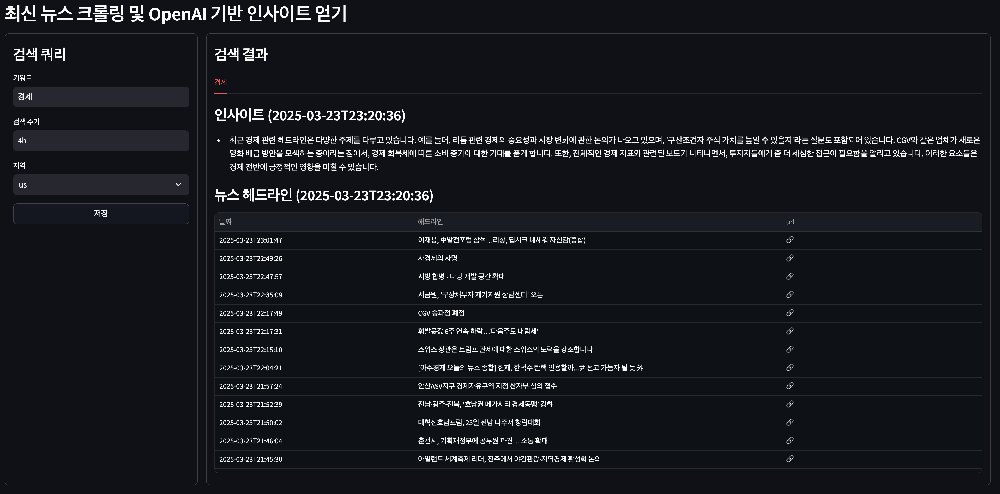

# OpenAI API 기반 뉴스 인사이트 얻기

## Requirements
```
- OS: MacOS or Linux
- Anaconda
- Python 3.11
- 기타 Python 패키지 (requrements.txt) 참조
```

## Description
Google News에서 크롤링한 뉴스 헤드라인에서 OpenAI API를 활용하여 인사이트 얻기<br>
기타 자세한 설명은 아래 블로그 참고
- [OpenAI API를 활용한 관심 있는 주제에 대한 뉴스 인사이트 얻기 #1]()
- []()

## 기본 프로그램 실행
### 크롤러 테스트
```
python test_crawler.py
```
```
news_list = list()
with GoogleNewsCrawler() as crawler:
    q_list = [
        {
            'q': 'economy',
            'time': '4h',
            'location': 'us'
        },
        {
            'q': '국내 경제',
            'time': '4h',
            'location': 'ko'
        }
    ]
    for q in q_list:
        news = crawler.crawl(q)
        news_list += news
print_log(news_list)
save_to_json(news_list)
```
- main.py 코드 내에서 `q_list` 내용 변경 후 실행
- 크롤링 결과는 `save_to_json` 함수를 사용하여 json 파일로 저장
- 결과 샘플 파일: `news_data.json`

### schedule기반 주기저인 크롤링 작업
```
python job_news_insight.py
```
```
_, time_data, _ = get_news_insight_config('news_insight_config.txt')
time_data = time_data[:-1]
time_data = int(time_data)
print_log(f'Schedule Interval: {time_data}')
job_news_insight_schedule()

for hour in range(0, 24, time_data):
    time_info = f'{hour:02d}:00'
    schedule.every().day.at(time_info).do(job_news_insight_schedule)

while True:
    schedule.run_pending()
    time.sleep(10)
```
- schedule기반 주기적으로 크롤링 및 OpenAI API를 활용해 인사이트 얻음

### streamlit 활용 웹 표시
```
python -m streamlit run streamlit_app.py --server.port 8503
```
- streamlit 활용하여 웹 상에 이미지 표시


- `키워드`, `검색 주기`, `지역` 수정 후 저장 시 background로 동작하는 `job_news_insight.py` 재실행

## Background 웹 실행 방법
### Edit 기능 활성화
- `streamlit_app.py` 내 `use_text_input = True` 변경
### 실행 방법
```python
nohup python -m streamlit run streamlit_app.py --server.port 8501 > streamlit.log 2>&1 &; disown;
```
- nohup python으로 백그라운드 실행
